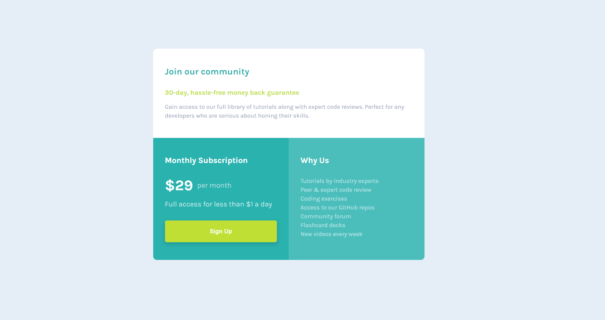

# Frontend Mentor - Single price grid component solution

This is a solution to the [Single price grid component challenge on Frontend Mentor](https://www.frontendmentor.io/challenges/single-price-grid-component-5ce41129d0ff452fec5abbbc). Frontend Mentor challenges help you improve your coding skills by building realistic projects. 

## Table of contents

- [Overview](#overview)
  - [The challenge](#the-challenge)
  - [Screenshot](#screenshot)
  - [Links](#links)
- [My process](#my-process)
  - [Built with](#built-with)
  - [What I learned](#what-i-learned)
  - [Continued development](#continued-development)
  - [Useful resources](#useful-resources)
- [Acknowledgments](#acknowledgments)

**Note: Delete this note and update the table of contents based on what sections you keep.**

## Overview

### The challenge

Users should be able to:

- View the optimal layout for the component depending on their device's screen size
- See a hover state on desktop for the Sign Up call-to-action

### Screenshot

### Links

- Solution URL: [Add solution URL here](https://your-solution-url.com)
- Live Site URL: [Add live site URL here](https://your-live-site-url.com)

## My process

### Built with

- Semantic HTML5 markup
- CSS custom properties
- Flexbox
- CSS Grid
- Mobile-first workflow

### What I learned

I learned useful ways to streamline the development process such as: 
  1. Starting with the HTML structure to get a general idea of the page layout.
  2. Deciding on font sizes and colors when begining the styling process and additionally making these values globally available
     through the use of CSS variables.
  3. Starting with a mobile first mentality, only adding complexity to the design as need such as when designing for larger screen
     sizes.

### Continued development

  This was my first time attempting to use the BEM (Block Element Modifier) methodology for naming HTML/CSS classes. I learned alot about the methodology and found it quite useful although I feel I could use more practice applying BEM and refining the skill. 

## Acknowledgments

I owe many of the tips for streamlining the project to the Youtuber Kevin Powell. I find his Content to be very informative when it comes to CSS and simplifying the web for newcomers. This is a link to his Youtube page https://www.youtube.com/channel/UCJZv4d5rbIKd4QHMPkcABCw

